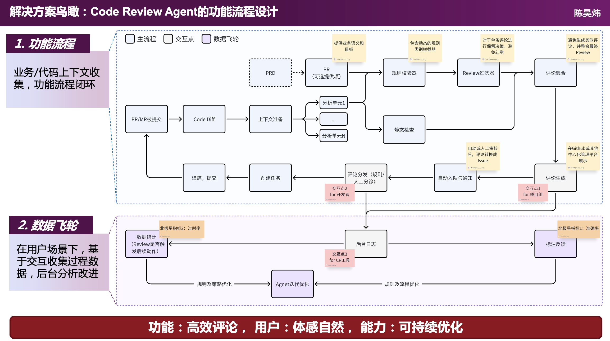
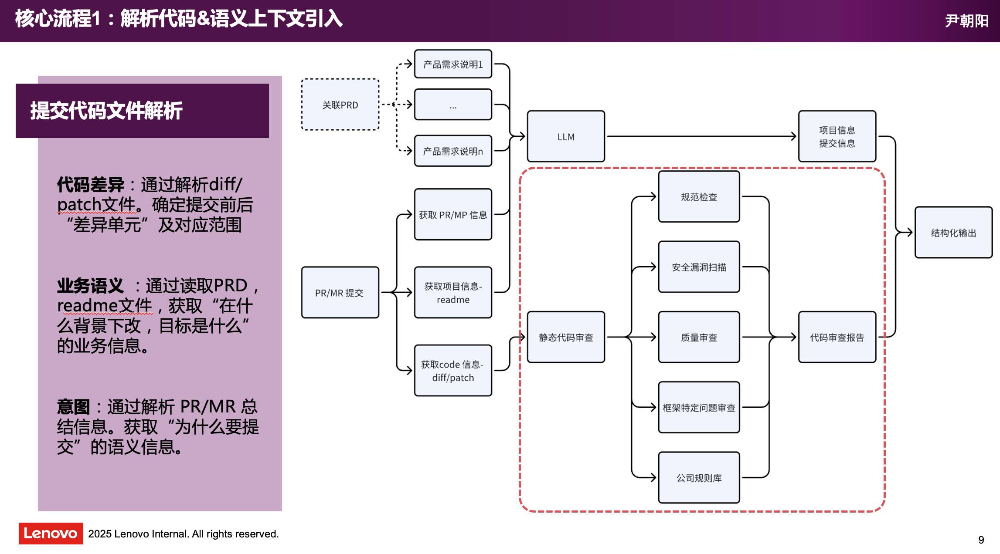
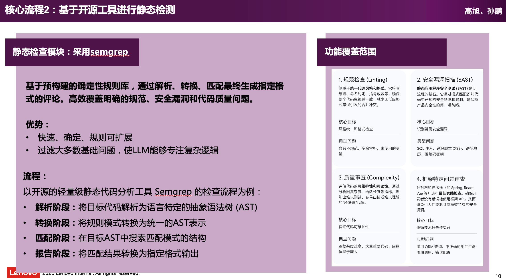
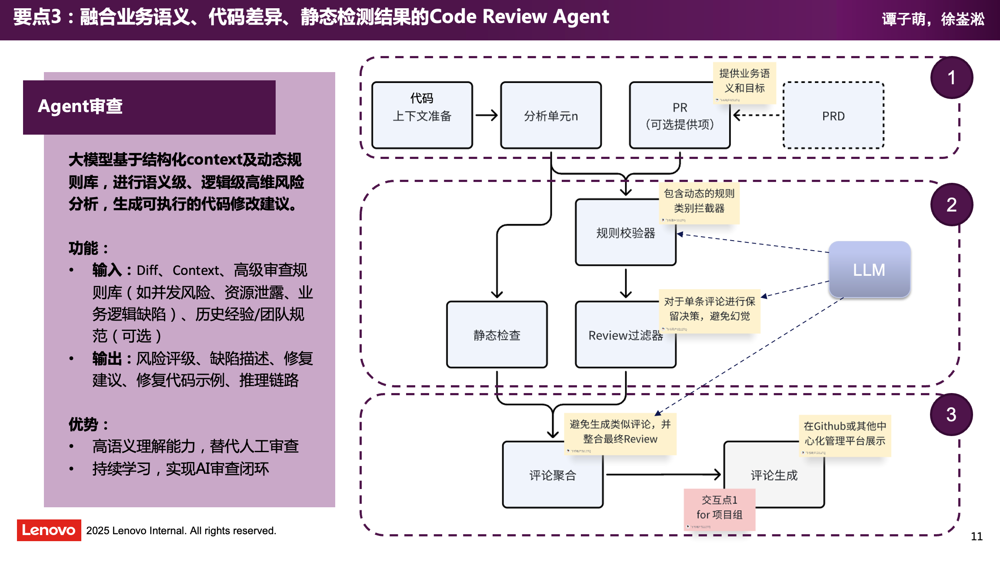
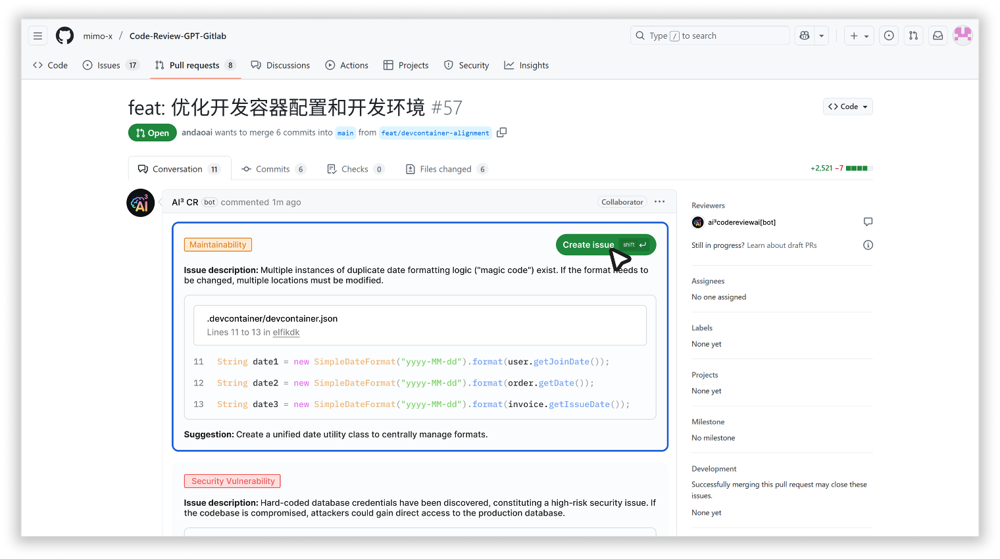
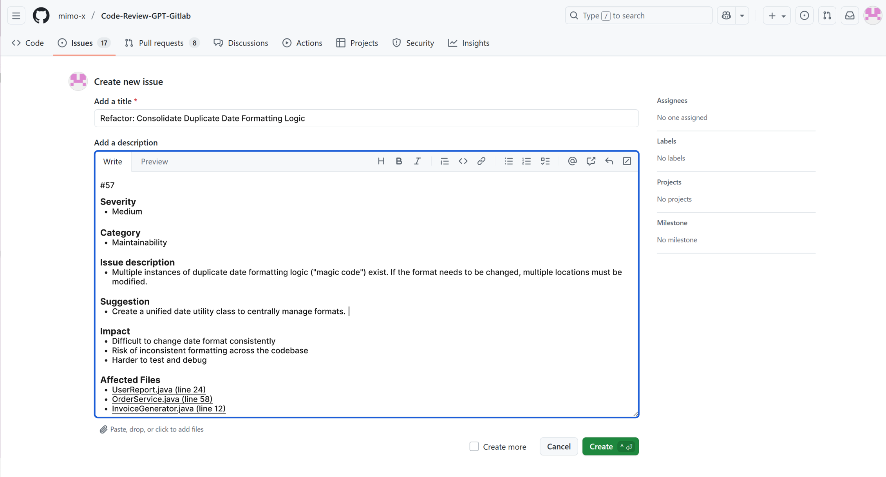
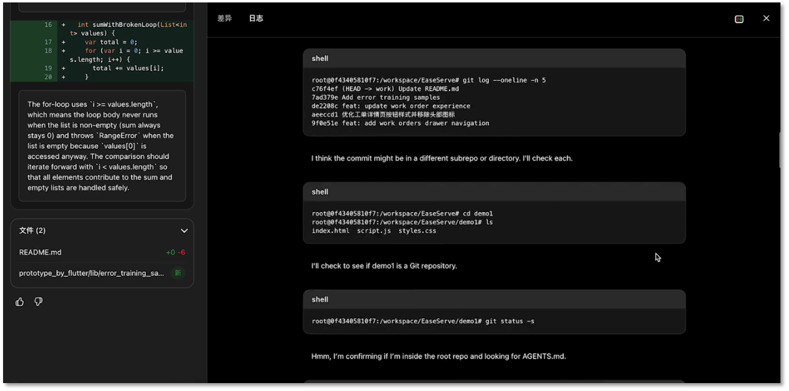

# AI3_CR_Agent

一个可运行的 Python 版 Code Review Agent。

当前目标很明确：
- 输入一次代码提交的 `diff/patch`
- 基于改动定位最小关联上下文
- 组装 LLM 审查输入
- 调用真实 LLM API 生成 review findings
- 将结构化结果写入 JSON 文件
- 基于 JSON 结果生成 PR Review、Create Issue、Issue List、Issue Detail 页面

## 当前最小设计

```text
Diff / Patch
  -> Diff Parser
  -> Change Unit Builder
  -> Minimal Context Resolver
  -> Static Checks on Touched Files
  -> LLM Review Input Builder
  -> OpenAI Responses API
  -> Structured Findings JSON
  -> PR Review / Issue Pages
```

### 最小上下文策略

默认只取三层信息：
- 变更 hunk 本身
- hunk 落入的完整函数或类方法
- 同文件一跳依赖定义

只有信息不足时，才继续扩展上下文范围。这是当前阶段最重要的控 token 策略。

### 当前仓库结构

```text
AI3_CR_Agent/
  src/ai3_cr_agent/
    analysis/
    domain/
    parsers/
    cli.py
    pipeline.py
  examples/cases/python_null_guard/
    diff.patch
    pr_summary.md
    repo_summary.md
    review_rules.json
    source_snapshot/
  tests/
```

## 配置 API Key

在 `AI3_CR_Agent/.env` 填写你的 OpenAI 配置。

1. 复制一份配置模板：

```bash
cp .env.example .env
```

2. 修改 `.env` 中的 `OPENAI_API_KEY`：

```dotenv
OPENAI_API_KEY=你的真实key
OPENAI_MODEL=gpt-4o-mini
OPENAI_BASE_URL=https://api.openai.com/v1
OPENAI_TIMEOUT_SECONDS=60
```

默认会优先读取当前 shell 环境变量；如果没有，再读取 `AI3_CR_Agent/.env`。

## 快速开始

在 `AI3_CR_Agent/` 目录执行：

```bash
PYTHONPATH=src python -m ai3_cr_agent run examples/cases/python_null_guard
```

运行后会在 `examples/cases/python_null_guard/build/` 下生成：
- `parsed_changes.json`
- `resolved_contexts.json`
- `change_summary.md`
- `agent_input.json`
- `review_run.json`
- `review_findings.json`
- `review_comments.md`
- `pr_review.html`
- `issue_create.html`
- `issues.html`
- `issue_detail.html`

其中：
- `review_findings.json` 是 LLM 最终生成的结构化审查结果
- `review_run.json` 保存了本次模型、摘要、请求载荷和原始响应
- HTML 页面都基于本次 LLM 审查结果生成

## Skills 接入

当前 Code Review 已支持 Skills 注入。

工作方式：
- 在 case 目录下放置 `review_skills.json`
- 在仓库根目录 `skills/` 下维护对应 Skill
- pipeline 在准备 `agent_input` 时会自动加载这些 Skill
- `agent_input.active_skills` 只保留 Skill 元信息，不直接写入 Skill 正文
- 对于 Kimi K2.5 这类 `chat/completions` 接口，Skill 通过原生 `tools` 方式按需读取，不作为初始上下文直接注入

示例 case 已启用：
- `custom_coding_conventions`
- `security_review_companion`

目录结构示例：

```text
AI3_CR_Agent/
  skills/
    custom_coding_conventions/
      skill.json
      SKILL.md
    security_review_companion/
      skill.json
      SKILL.md
  examples/cases/python_null_guard/
    review_skills.json
```

说明：
- `skill.json` 用于定义 Skill 的名称和描述
- `SKILL.md` 用于写具体能力说明和审查要求
- `review_skills.json` 用于选择本次审查启用哪些 Skills

## 后台页面

如果你需要通过后台页面分阶段操作：

```bash
PYTHONPATH=src python -m ai3_cr_agent serve examples/cases/python_null_guard --port 8000
```

启动后访问：

```text
http://127.0.0.1:8000/admin/input
```

后台包含两页：
- 第一页展示“解析 PR 后模型最终输入”，并提供“开始生成 Code Review”按钮
- 第二页通过 SSE 展示模型流式输出和执行状态
- 生成完成后点击“推送 Review”，会将结果写入 `build/` 并跳转到 `pr_review.html`

## 示例输入文件组

示例 case 位于 `examples/cases/python_null_guard/`，包含：
- `diff.patch`: 提交改动
- `pr_summary.md`: 提交意图和背景
- `repo_summary.md`: 仓库级业务上下文
- `review_rules.json`: 当前阶段的审查规则
- `source_snapshot/`: 用于最小上下文解析的代码快照

这组文件就是当前最小版 Agent 的静态输入基础。

## 当前执行结果

- Code Review 内容由真实 LLM API 生成
- 审查结果落盘到 JSON 文件
- PR Review 页面直接展示 LLM findings
- 点击具体 review 项可以创建 issue
- 创建后会进入对应的 issue 详情页
- Issues 列表页和 Issue 详情页都读取基于 review 创建出的 issue 数据

## 原始设计草图

整体方向仍然参考以下设计图：



### Part1 代码解析及语义上下文引入



### Part2 基于开源工具给出建议



### Part3 融合业务语义的 Code Review 生成



### Part4 交互方案

#### （1）PR内CodeReview结论

**将****CR** **Agent****生成的****Code** **Review****项聚合后，以评论形式同步该仓库对应****Pull** **Request****内形成评论，并以邮件形式推送给关键成员。**

**目的：**

•Code Review结论广播与触达

**功能：**

•自动生成issue并附AI建议

•关键角色邮件触达

**优势：**

•结构化呈现 {严重性，错误类别，描述，位置，建议，任务分发入口}，保证信息传递效率

•便于在仓库中快速定位问题位置



#### （2）基于Code Review中具体的项创建Issue

支持针对评论中特定项快速创建issue，自动携带该项评论内容，并埋点记录任务分发情况

**目的：**

•快捷任务分发

•采纳率数据采集

**功能：**

•点击按钮后快捷创建issue并附对应评论内容

**优势：**

•融入用户原生工作流

•无感的反馈数据采集



#### （3）Code Review Agent后台

**整合全流程数据形成可视化仪表盘，为管理层提供质量、绩效、趋势全局视图支撑决策。**

**目的：**Agent能力的快速评估和分析后台，同时作为数据标注工作台。

**功能：**

•多维度质量仪表盘

•数据标注工作台

•缺陷分类统计分析

•单条评论生成链路日志可视

•数据导出审计

**优势：**

•有效聚类问题并评估Agent

•辅助Agent快速迭代改进


